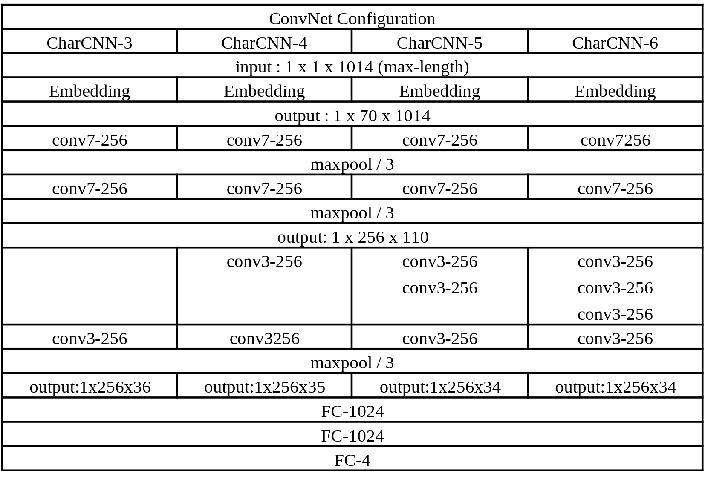
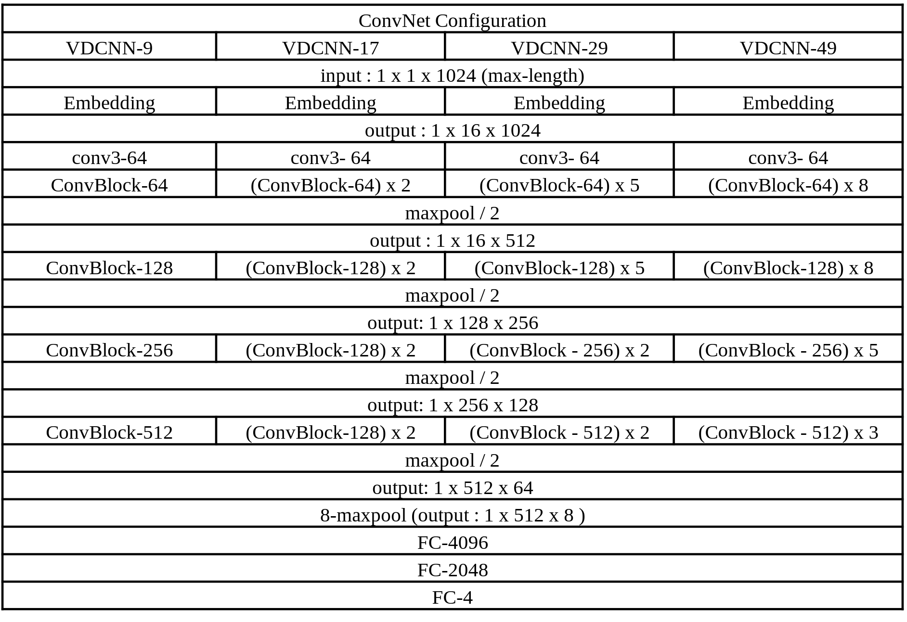

## Model

Convolutions with kernel size 3x3 and X feature maps are denoted ”conv3-X”.

Temporal convolutions with kernel size 1x3 and X feature maps are denoted ”conv3-X”.

”max pool / 2” means  max-pooling with kernel size 3 and stride 2.

- VGG-family : The architectures of the nn are shown below :

  

- ResNet-family : The architectures of the nn are shown below :

  

- CharCNN : The architectures of the nn are shown below :

  

- VDCNN : The architectures of the nn are shown below :

  

