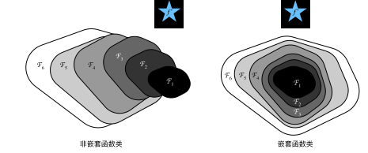

### FlexiFed

复现论文 : [FlexiFed: Personalized Federated Learning for Edge Clients with Heterogeneous Model Architectures](https://dl.acm.org/doi/10.1145/3543507.3583347)


### 项目结构

```bash
.
├── FlexiFed
│   ├── models
│   │   ├── CharCNN.py
│   │   ├── ResNet.py
│   │   ├── VDCNN.py
│   │   └── VGG.py
│   ├── scripts
│   │   ├── agnews_dataset.py
│   │   ├── draw.py
│   │   ├── FedStrategy.py
│   │   ├── GlobalTrain.py
│   │   ├── LocalTrain.py
│   │   ├── predict.py
│   │   ├── speech_commands_dataset.py
│   │   └── utils.py
│   └── train.py
└── README.md 
```


### 模型架构

**说明：**

1. `X` 个 `3x3 ` 大小的卷积核记为 `conv3-X`
2. `max pool / 2`  表示  max-pooling 窗口大小为 `3x3`，步长为 `2`

3. 在 `VDCNN` 和 `CharCNN` 中， `X` 个 `1x3` 大小卷积核记为 `conv3-X`

​		`max pool / 2`  表示  max-pooling 窗口大小为 `1x3`，步长为 `2`

- **VGG-family**

<center>
    
    <br>
    <div style="color:orange; border-bottom: 1px solid #d9d9d9;
    display: inline-block;
    color: #999;
    padding: 2px;">
      VGG-family架构
  	</div>
</center>


- **ResNet-family**

<center>
    
    <br>
    <div style="color:orange; border-bottom: 1px solid #d9d9d9;
    display: inline-block;
    color: #999;
    padding: 2px;">
      ResNet-family架构
  	</div>
</center>


- **VDCNN-family**

<center>
    
    <br>
    <div style="color:orange; border-bottom: 1px solid #d9d9d9;
    display: inline-block;
    color: #999;
    padding: 2px;">
      VDCNN-family架构
  	</div>
</center>


- **CharCNN-family**

<center>
    
    <br>
    <div style="color:orange; border-bottom: 1px solid #d9d9d9;
    display: inline-block;
    color: #999;
    padding: 2px;">
      CharCNN-family架构
  	</div>
</center>


### 参数设置

- Optimizer : torch.optim.SGD 
- Learning Rate : 0.01 （对于SpeechCommands数据集，采用1e-4）
- Momentum : 0.9 
- Weight_decay : 5e-4 （对于SpeechCommands数据集，采用1e-2）
- num_clients : 8 


### 复现结果

**说明：**

1. 表中数据均为最后50个round取均值的结果（基本收敛）
2. 由于VDCNN在测试中频繁震荡，认为取均值并不能很好地衡量正确率，故没有做VDCNN的表格


- VGG-family on CIFAR-10 :

  <center>
      
      <br>
      <div style="color:orange; border-bottom: 1px solid #d9d9d9;
      display: inline-block;
      color: #999;
      padding: 2px;">
        A
    	</div>
  </center>
  
  <center>
      
      <br>
      <div style="color:orange; border-bottom: 1px solid #d9d9d9;
      display: inline-block;
      color: #999;
      padding: 2px;">
        B
    	</div>
  </center>
  |     Stategy      |  V1  |  V2  |  V3  |  V4  |
  | :--------------: | :--: | :--: | :--: | :--: |
  |   Basic-Common   | 72.9 | 76.0 | 74.6 | 76.9 |
  | Clustered-Common | 76.8 | 78.7 | 79.3 | 78.2 |
  |    Max-Common    | 77.1 | 83.9 | 81.6 | 81.3 |
  
  
  
- VGG-family on CINIC-10 :

  <center>
      
      <br>
      <div style="color:orange; border-bottom: 1px solid #d9d9d9;
      display: inline-block;
      color: #999;
      padding: 2px;">
        A
    	</div>
  </center>
  <center>
      
      <br>
      <div style="color:orange; border-bottom: 1px solid #d9d9d9;
      display: inline-block;
      color: #999;
      padding: 2px;">
        B
    	</div>
  </center>

  |     Stategy      |  V1  |  V2  |  V3  |  V4  |
  | :--------------: | :--: | :--: | :--: | :--: |
  |   Basic-Common   | 60.6 | 63.7 | 62.9 | 62.6 |
  | Clustered-Common | 63.4 | 67.9 | 66.6 | 65.5 |
  |    Max-Common    | 63.7 | 69.8 | 68.5 | 66.5 |

  

- VGG-family on Speech Commands :

  <center>
      
      <br>
      <div style="color:orange; border-bottom: 1px solid #d9d9d9;
      display: inline-block;
      color: #999;
      padding: 2px;">
        A
    	</div>
  </center>
  <center>
      
      <br>
      <div style="color:orange; border-bottom: 1px solid #d9d9d9;
      display: inline-block;
      color: #999;
      padding: 2px;">
        B
    	</div>
  </center>

  |     Stategy      |  V1  |  V2  |  V3  |  V4  |
  | :--------------: | :--: | :--: | :--: | :--: |
  |   Basic-Common   | 85.5 | 85.9 | 84.9 | 83.2 |
  | Clustered-Common | 87.5 | 88.8 | 87.2 | 86.4 |
  |    Max-Common    | 88.1 | 90.7 | 90.7 | 90.6 |

  

- ResNet-family on CIFAR-10 :

  <center>
      
      <br>
      <div style="color:orange; border-bottom: 1px solid #d9d9d9;
      display: inline-block;
      color: #999;
      padding: 2px;">
        A
    	</div>
  </center>
  <center>
      
      <br>
      <div style="color:orange; border-bottom: 1px solid #d9d9d9;
      display: inline-block;
      color: #999;
      padding: 2px;">
        B
    	</div>
  </center>
  
  |     Stategy      |  V1  |  V2  |  V3  |  V4  |
  | :--------------: | :--: | :--: | :--: | :--: |
  |   Basic-Common   | 74.5 | 75.0 | 75.4 | 75.3 |
  | Clustered-Common | 77.8 | 78.4 | 79.5 | 80.0 |
  |    Max-Common    | 78.5 | 79.4 | 78.4 | 79.6 |
  
  
  
- ResNet-family on CINIC-10 :

  <center>
      
      <br>
      <div style="color:orange; border-bottom: 1px solid #d9d9d9;
      display: inline-block;
      color: #999;
      padding: 2px;">
        A
    	</div>
  </center>
  <center>
      
      <br>
      <div style="color:orange; border-bottom: 1px solid #d9d9d9;
      display: inline-block;
      color: #999;
      padding: 2px;">
        B
    	</div>
  </center>
  
  |     Stategy      |  V1  |  V2  |  V3  |  V4  |
  | :--------------: | :--: | :--: | :--: | :--: |
  |   Basic-Common   | 62.9 | 63.0 | 63.3 | 63.6 |
  | Clustered-Common | 64.9 | 65.8 | 66.1 | 66.7 |
  |    Max-Common    | 65.0 | 66.1 | 66.6 | 66.9 |
  
  
  
- ResNet-family on Speech Commands :

  <center>
      
      <br>
      <div style="color:orange; border-bottom: 1px solid #d9d9d9;
      display: inline-block;
      color: #999;
      padding: 2px;">
        A
    	</div>
  </center>
  <center>
      
      <br>
      <div style="color:orange; border-bottom: 1px solid #d9d9d9;
      display: inline-block;
      color: #999;
      padding: 2px;">
        B
    	</div>
  </center>
  
  |     Stategy      |  V1  |  V2  |  V3  |  V4  |
  | :--------------: | :--: | :--: | :--: | :--: |
  |   Basic-Common   | 83.8 | 85.2 | 84.2 | 83.7 |
  | Clustered-Common | 84.6 | 84.7 | 85.7 | 85.3 |
  |    Max-Common    | 85.9 | 85.5 | 85.4 | 86.8 |
  
  
  
- CharCNN-family on AG News :

  <center>
      
      <br>
      <div style="color:orange; border-bottom: 1px solid #d9d9d9;
      display: inline-block;
      color: #999;
      padding: 2px;">
        A
    	</div>
  </center>
  <center>
      
      <br>
      <div style="color:orange; border-bottom: 1px solid #d9d9d9;
      display: inline-block;
      color: #999;
      padding: 2px;">
        B
    	</div>
  </center>
  
  |      Scheme      |  V1  |  V2  |  V3  |  V4  |
  | :--------------: | :--: | :--: | :--: | :--: |
  |   Basic-Common   | 81.2 | 83.4 | 81.9 | 82.1 |
  | Clustered-Common | 83.6 | 83.4 | 82.0 | 83.0 |
  |    Max-Common    | 82.7 | 83.6 | 82.2 | 83.1 |
  
  
  
- VDCNN-family on AG News :

  <center>
      
      <br>
      <div style="color:orange; border-bottom: 1px solid #d9d9d9;
      display: inline-block;
      color: #999;
      padding: 2px;">
        A
    	</div>
  </center>
  <center>
      
      <br>
      <div style="color:orange; border-bottom: 1px solid #d9d9d9;
      display: inline-block;
      color: #999;
      padding: 2px;">
        B
    	</div>
  </center>


### 与论文对比

正确率汇总见下表:

 <center>
    
    
    <br>
    <div style="color:orange; border-bottom: 1px solid #d9d9d9;
    display: inline-block;
    color: #999;
    padding: 2px;">
      与论文数据对比
  	</div>
</center>

结合上表和复现结果中的曲线和数据，基本上可以得出结论：
$$
Basic\text{-}Common < Clustered\text{-}Common < Max\text{-}Common
$$


### 问题

1. **表中结果普遍比论文中得到的结果偏低**

可能的原因：

- 论文中该表数据是在 `client` 数为40的条件下得到的，而本实验是在 `client` 数为8的条件下得到的，根据论文中的结论，`client` 数越多，收敛得到的正确率越高。

    - 关于我选择在 `client` 数为8条件下实验的原因：采用数据集 `CIFAR-10` 训练 `VGG-family`

        并采用 `Basic-Common` 策略

        - 在`client` 数为 `8` 条件下训练，大约 `150` 轮就开始收敛
        - 在`client` 数为 `40` 条件下训练，大约 `1000` 轮仍然未收敛，仍处于上升趋势，训练时长超过8小时

        所以，在实验条件受限，并且观测到正确率相差不大的情况下，我选择了在`client` 数为 `8` 条件下训练

- 由于实验条件受限，存在许多未完全收敛的情况，仍然有非常缓慢上升的趋势


2. **不同初始化方法，对模型收敛速度影响巨大**

问题的发现：在 `CINIC-10` 和 `SpeechCommands` 数据集上，不论是 `VGG-faily` 还是 `ResNet-family`，用正态分布初始化参数，都存在以下问题：

- 大概率出现频繁震荡，始终不收敛
- 即便开始增长，收敛速度较慢

 <center>
    
    
    <br>
    <div style="color:orange; border-bottom: 1px solid #d9d9d9;
    display: inline-block;
    color: #999;
    padding: 2px;">
      VGG-family on SpeechCommands
  	</div>
</center>

上图左采用正态分布初始化参数，图右采用xavier-normal初始化参数

可以明显看出，xavier-normal明显加速了模型的收敛

并且在之后的多次训练过程中，均观察到采用xavier-normal作为参数初始化方法，在 `AGNews` 数据集上也可以明显减少不收敛的概率，并且加快收敛速度


3. **VDCNN在训练过程中发生频繁震荡**

重复多次实验仍然出现频繁震荡的情况


4. **在多组数据中，均出现较深层模型正确率低于较浅层模型**

可能的原因：

1. 由于实验条件受限，存在许多未完全收敛的情况，仍然有非常缓慢上升的趋势
2. 对于不同的数据集，若模型最终拟合的函数不属于嵌套关系，可能会出现较深层模型得到的结果，比合适层数模型得到的结果要差

<center>
    
    <br>
    <div style="color:orange; border-bottom: 1px solid #d9d9d9;
    display: inline-block;
    color: #999;
    padding: 2px;">
      模型类别
  	</div>
</center>
