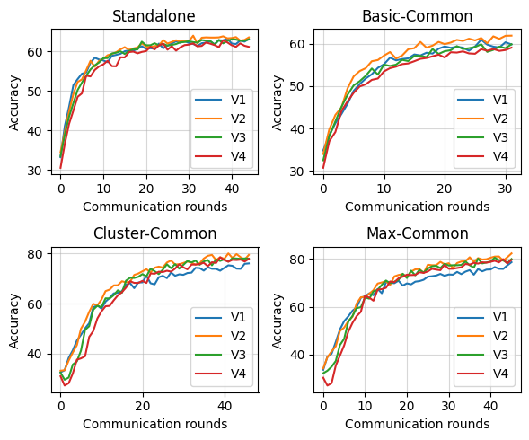

## 总结第一阶段的复现工作

说明：

- 实验平台： 主要在 kaggle 上进行实验

- 由于实验条件受限，没有足够的训练时间使得模型收敛
- 由于我是从 0 开始学习pytorch、深度学习网络，有错误的地方恳请老师多多指点

> 记号说明：图示中V1-V4分表表示 VGG{11, 13, 16, 19}
>
> 数据说明：共有40个client，分成4组，分别运行VGG四种不同结构的网络，每组内求平均，得到该种网络结构的正确率

### 实验结果

### 结果分析

#### Standalone

作为检验网络搭建和实验条件正确性的证明

从图中可以看出，结果同论文中的结果 `[64.4, 64.8, 65.2, 65.6]` 还是较为接近的

结果分析：

- 在训练初期，层数较深的模型的正确率基本上都是低于层数较浅模型的正确率，这个结论在上图中4种情况都可以得到验证
- 由于训练时间受限，模型没有收敛，导致出现了 `V4` 正确率反而不如层数较浅的模型，但是这反过来说明了在硬件设备算力有限的情况下，采用层数中等（如 `V2,V3`）的模型，可能会得到更优的结果
- 与论文结果相近，说明网络搭建和实验条件基本上是正确的

#### Basic-Common

作为检验我对 `FlexiFed` 三种策略理解的检验

在确定了client的模型分布，那么 `Basic-Common` 策略，就是简单的将 `V1-V4 `的第一层卷积层的参数聚合

结果分析：

- 对比Standalone，发现正确率的上升速度反而变慢了
- 但是从曲线的上升趋势可以看出，Standalone已经接近收敛了，`Basic-Common`还有上升的空间

#### Cluster-Common

在确定了client的模型分布，那么 `Cluster-Common` 策略，在 `Basic-Common`的基础上，按照模型结构分成4类，相同种类的模型聚合除了common-base-layers的卷积层

结果分析：

- 在这组实验中训练后期，较深层的模型展现出了优势，但是中等深度的模型 `V2,V3`仍然表现优秀
- 总体上来说，正确率仍有上升的趋势，并且从最后得到的结果，与论文中给出的结果也是比较接近的

#### Max-Common

在确定了client的模型分布，`Max-Common` 策略，将所有地位等同的卷积层进行聚合

分析同 Cluster-Common，并且可以发现在这组实验中，最后上升趋势比 `Cluster-Common`更为明显

但是我复现的结果基本没有表现出这两种策略加速比有明显的差别，不知道我的实现中哪里有遗漏或错误的地方