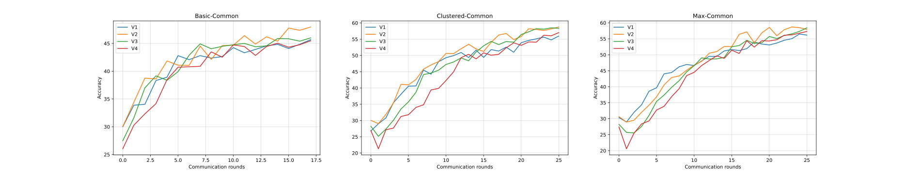
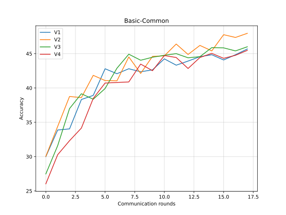
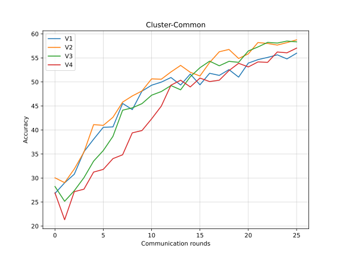
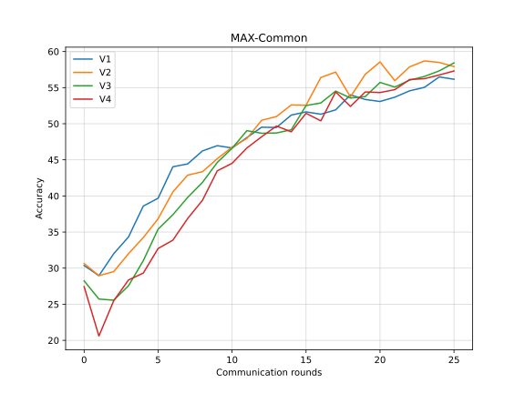

## CINIC-10复现结果分析

下图是3种FlexiFed策略的对比图

### Basic-Common

> 由于训练平台（kaggle）出现了一些未知错误，训练中途系统崩溃了，只记录到第17轮的结果，之后会重新训练一次

### Clustered-Common

### MAX-Common

1. 同 CIFAR-10，在Clustered-Common 和 Max-Common策略下，第一轮参数聚合后，越深层的模型，正确率的退化越明显
2. 在所有策略中，包括Standalone，较深模型的正确率始终很难超过较浅模型的正确率（在cifar10上也是，可能是因为我没有足够的训练时长）